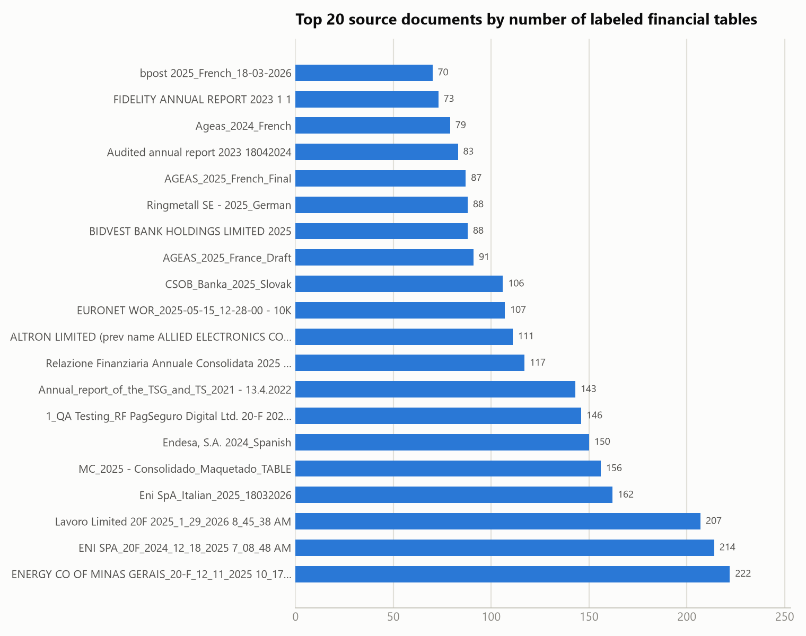
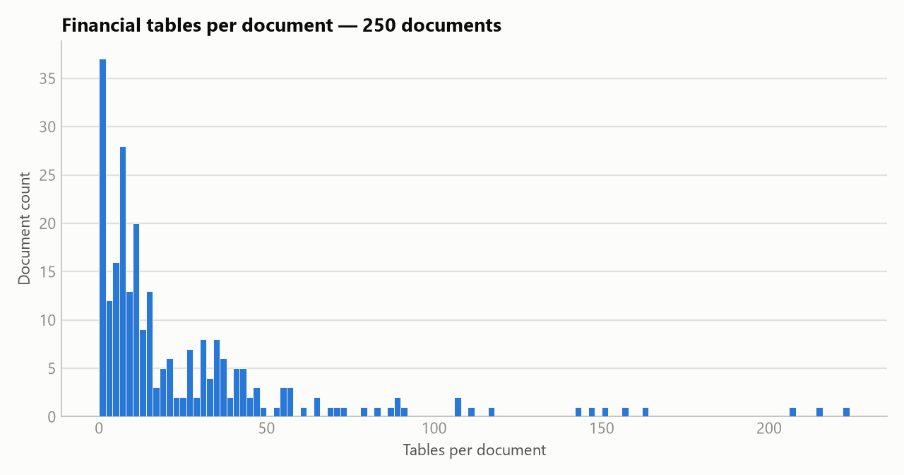
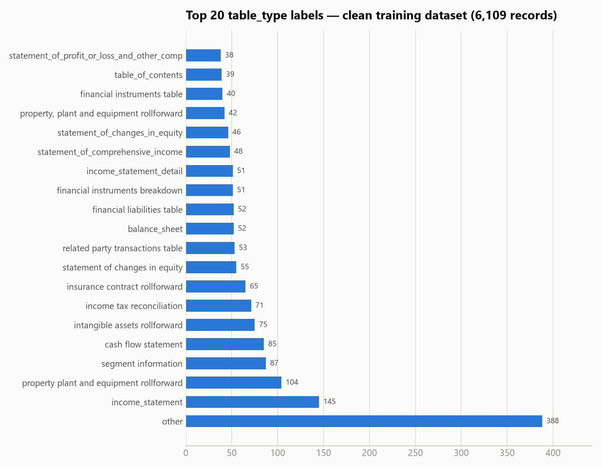
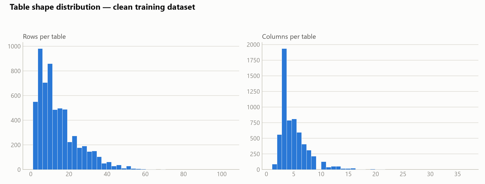
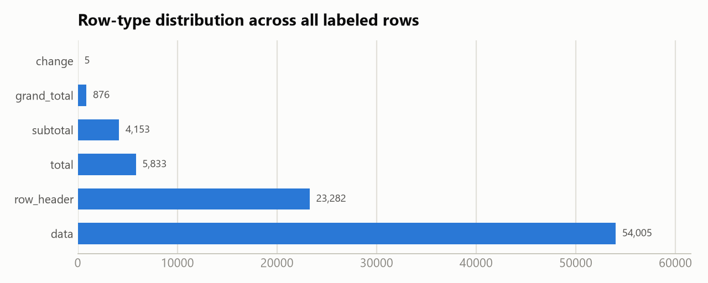
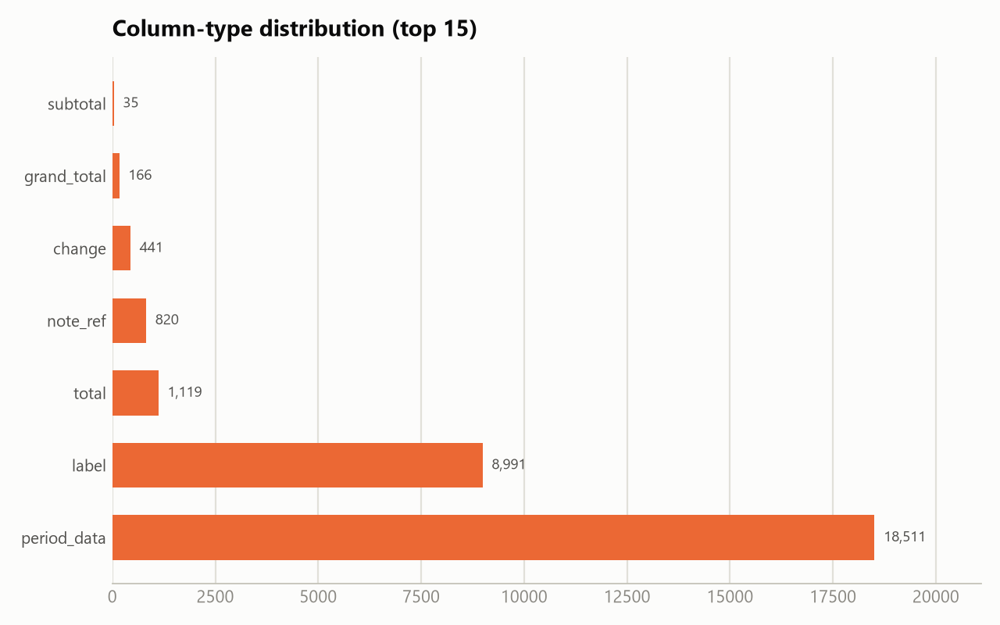
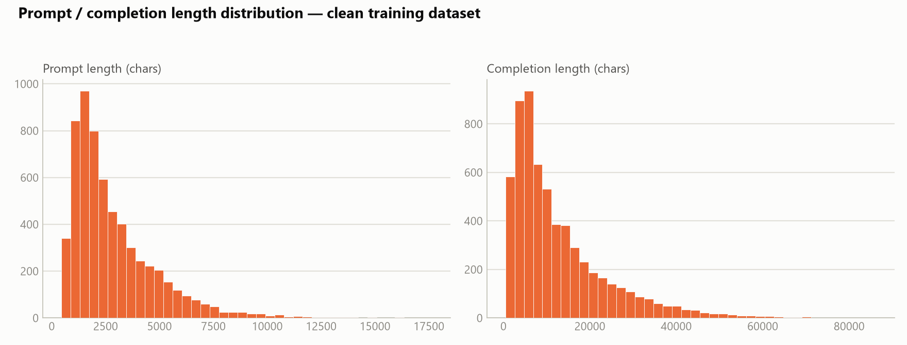
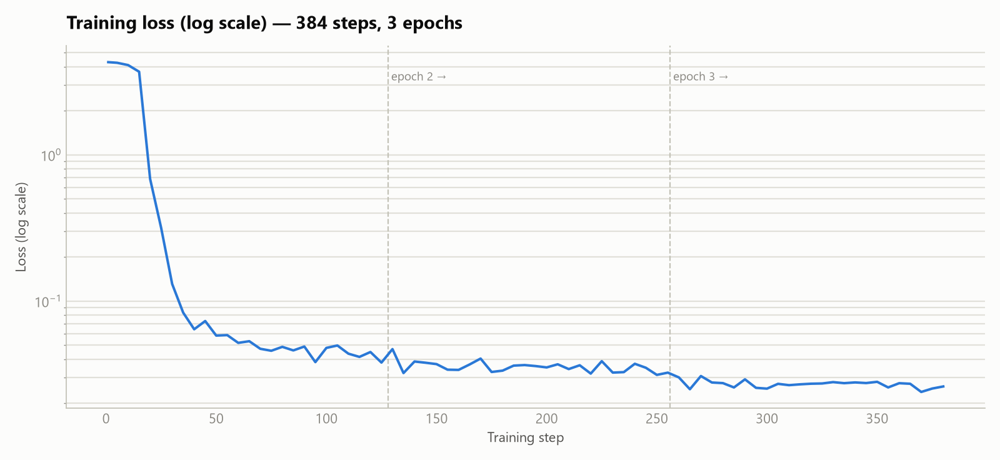
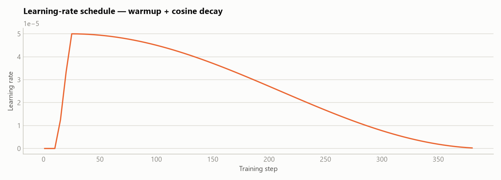

# Training Dataset Report — `dataset_v16v2_200726.clean.jsonl`

**Model target:** Qwen3.5-4B financial-table-structure analyst (LoRA fine-tune, `teamspace_uploads_Qwen3.5-4B_v16v2_clean_dataset_220726_3epochs`)
**Dataset file:** `dataset_v16v2_200726.clean.jsonl` (6,109 records, ~105 MB)
**Source corpus:** `C:\Users\mandar.ukrulkar\Downloads\data_raw_in_out_jsons_200726\output` (the exact job-output snapshot used to build the dataset)
**Report generated:** 2026-07-24

---

## 1. Executive summary

| Metric | Value |
|---|---|
| Source documents processed | 249 unique financial-statement documents (+3 re-run twice, +1 non-classification QA job) |
| Total tables detected by the parser | 19,821 |
| Tables classified as *financial* (candidates for labeling) | 6,260 |
| Tables skipped as non-financial (TOC, prose, boilerplate) | 13,532 (68%) |
| Labeled input/response pairs found on disk | 6,290 (6,289 with a matching response — the one unmatched input is correctly excluded) |
| Raw compiled dataset (`dataset_v16v2_200726.jsonl`) | 6,289 records — **exact match** to the source corpus |
| **Final clean training dataset** (`*.clean.jsonl`) | **6,109 records** |
| Removed by de-duplication | 180 records (2.9%) |
| Distinct `table_type` label strings | 2,232 (long-tail, free-text-ish taxonomy) |
| Median table shape | 11 rows × 4 columns |
| Median prompt / completion length | 2,225 / 9,035 characters |
| Fine-tuning method | LoRA (r=32, alpha=64) on Qwen/Qwen3.5-4B, 1× NVIDIA L4 GPU |
| Training run | 3 epochs / 384 steps, effective batch 48, ~14.7 hours |
| Final training loss (epoch 3 mean) | ~0.027 (down from ~4.3 pre-warmup) |

The training set is built from real financial-statement tables (10-Ks, 20-Fs, annual reports, insurance/bank filings) extracted and pre-labeled by an Azure LLM pass, then compiled and de-duplicated for supervised fine-tuning of a smaller local model to imitate that labeling.

---

## 2. How this report was produced

Two data sources were combined, per explicit instruction to use only these two locations:

1. **Source job outputs** — `C:\Users\mandar.ukrulkar\Downloads\data_raw_in_out_jsons_200726\output` (253 job folders), each a UUID directory containing one `job.json` (document metadata) plus one `classify_tbl-N_input.json` / `classify_tbl-N_response.json` pair per financial table. This is the exact snapshot `dataprep_140726.py` compiled from.
2. **The compiled training files** — `dataset_v16v2_200726.jsonl` (raw, via `dataprep_140726.py`) and `dataset_v16v2_200726.clean.jsonl` (de-duplicated, via `dataset_clean.py`), analyzed directly for the EDA in §5.

**Provenance check:** the source folder contains 6,290 `_input.json` files, of which 6,289 have a matching `_response.json` (the one unmatched input is correctly skipped by `dataprep_140726.py`'s pairing logic) — an **exact match** to the 6,289-record raw dataset. Unlike an earlier pass of this report (which reconstructed provenance from a different, partially-reorganized pair of folders), §3 below reconciles precisely with the compiled dataset — no representativeness caveat needed this time.

---

## 3. Source corpus

### 3.1 Job-level overview

| | |
|---|---|
| Total processing jobs | 253 |
| — classification jobs (`ai_provider: azure`) | 251 |
| — non-classification QA/extraction jobs (no labeling) | 2 |
| Unique source documents | 249 (+3 documents each re-run through the pipeline twice) |
| Tables per job (`table_count`) — median / mean / max | 64 / 79.0 / 691 |
| Financial tables per job — median / mean / max | 11.5 / 25.0 / 222 |

Every classification job used the same pipeline configuration (`ai_provider: azure`, `classified: true`). The two non-classification jobs were extraction-only test runs (`classify_table: false`) against the same QA file and contributed zero labeled tables.

### 3.2 Documents by number of labeled financial tables



The corpus is dominated by long-form annual filings — 20-F filings and full annual reports (Eni, ENI SPA, Lavoro, Energy Company of Minas Gerais, Endesa, MC Group) each contribute 150–222 tables, an order of magnitude more than a typical single-country statutory filing (~10–30 tables).

### 3.3 Table-count distribution across the corpus



Heavily right-skewed: 62% of documents (156 of 250) contribute fewer than 20 financial tables; a long tail of 12 large multi-jurisdiction filings each contribute 100+.

---

## 4. From source tables to training set

```
Parser output (job dirs)         19,821 tables detected
    └─ financial-table filter →   6,260 tables classified as financial
         └─ dataprep_140726.py →  6,289 (prompt, completion) records  → dataset_v16v2_200726.jsonl
              └─ dataset_clean.py (near-duplicate table_type resolution)
                   └─ 6,109 records → dataset_v16v2_200726.clean.jsonl   ← used for training
```

`dataset_clean.py` resolves cases where the same underlying table appears twice with conflicting `table_type` labels (e.g. `income tax reconciliation` vs `IncomeTaxReconciliation`), keeping one side by confidence score. This removed **180 records (2.9%)** from the raw compiled set. The clean file has a single, consistent completion schema across all 6,109 records: `{table_type, rows, columns, cells}`.

---

## 5. EDA — clean training dataset (6,109 records)

### 5.1 `table_type` label distribution



- **2,232 distinct label strings** across 6,109 records — the taxonomy is effectively open-vocabulary/free-text rather than a fixed enum (the LLM labeler produces both `snake_case` and human-readable variants, e.g. both `income_statement` and `income statement` occur as separate labels).
- `other` is the single largest bucket at 388 records (6.4%) — tables the labeler couldn't map to a specific known statement type.
- Beyond the top ~20, the distribution has a very long tail: most distinct labels occur only 1–3 times, meaning the model sees very few examples for the majority of specific table types it's expected to recognize.

### 5.2 Table shape



| | min | p25 | median | mean | p75 | p90 | p99 | max |
|---|---|---|---|---|---|---|---|---|
| Rows/table | 1 | 6 | 11 | 14.4 | 20 | 30 | 50 | 104 |
| Columns/table | 1 | 3 | 4 | 4.9 | 6 | 8 | 16 | 37 |
| Cells/table | 0 | 12 | 24 | 35.0 | 47 | 82 | 156 | 285 |

Tables are typically small (median 11×4 = 44 cells), but a long tail of wide/tall tables (segment breakdowns, multi-period rollforwards) reaches into the hundreds of cells — these drive the completion-length tail in §5.4.

### 5.3 Row and column semantic composition




Across all 6,109 tables, labeled rows total ~88,150 and columns ~30,083:

| Row type | Count | Share |
|---|---|---|
| `data` | 54,005 | 61.3% |
| `row_header` | 23,282 | 26.4% |
| `total` | 5,833 | 6.6% |
| `subtotal` | 4,153 | 4.7% |
| `grand_total` | 876 | 1.0% |
| `change` | 5 | <0.1% |

| Column type | Count | Share |
|---|---|---|
| `period_data` | 18,511 | 61.5% |
| `label` | 8,991 | 29.9% |
| `total` | 1,119 | 3.7% |
| `note_ref` | 820 | 2.7% |
| `change` | 441 | 1.5% |
| `grand_total` | 166 | 0.6% |
| `subtotal` | 35 | 0.1% |

Roughly 1 in 8 rows is a subtotal/total/grand-total — this is the structural signal (rollforwards, financial statements with running totals) the model needs to learn to distinguish from plain data rows.

### 5.4 Prompt / completion length



| | min | p25 | median | mean | p75 | p90 | p99 | max |
|---|---|---|---|---|---|---|---|---|
| Prompt (chars) | 443 | 1,437 | 2,225 | 2,859 | 3,720 | 5,472 | 10,055 | 17,648 |
| Completion (chars) | 427 | 4,807 | 9,035 | 12,721 | 17,255 | 28,522 | 52,758 | 86,231 |

Completions run **~4x longer than prompts on median** — expected, since the completion re-emits every row/column/cell of the input table plus classification metadata (type, confidence, concept IDs) for each. The p99 completion (~53K chars, ~13–18K tokens) and max (86K chars) are a meaningful tail that drives sequence-length/truncation decisions for training.

### 5.5 Label richness / confidence

- **Cell `concept_id` fill rate: 93.0%** — the large majority of cells are tagged with a financial concept (e.g. `NoteReference`, XBRL-style concepts), meaning the completions carry dense semantic labeling, not just structural typing.
- **Row `note_ref_value` fill rate: 7.4%** — footnote/note references are comparatively rare, concentrated in a subset of rows.
- **`table_type` confidence** — median 0.95, mean 0.93, min 0.20. The vast majority of labels carry high labeler confidence; a small tail of low-confidence labels (down to 0.20) exists and is worth spot-checking for label noise.

---

## 6. Training run

**Adapter:** `teamspace_uploads_Qwen3.5-4B_v16v2_clean_dataset_220726_3epochs` — a LoRA adapter fine-tuned on top of `Qwen/Qwen3.5-4B` using the clean 6,109-record dataset from §5, later merged into a standalone model via `merge_model.py`.

### 6.1 Setup

| | |
|---|---|
| Base model | Qwen/Qwen3.5-4B |
| Method | LoRA (PEFT 0.19.1) |
| LoRA rank / alpha / dropout | r=32, alpha=64, dropout=0.05 |
| LoRA target modules | `q_proj, k_proj, v_proj, o_proj, gate_proj, up_proj, down_proj, out_proj, in_proj_qkv, in_proj_a, in_proj_b, in_proj_z` |
| Hardware | 1× NVIDIA L4 GPU |
| Precision | fp16, gradient checkpointing on |
| Software | torch 2.8.0+cu128, transformers 5.14.1 |
| Dataset | `dataset_v16v2_200726.clean.jsonl`, 6,109/6,109 samples used, max sequence length 1,024 tokens |
| Epochs | 3 |
| Per-device batch size / grad. accumulation | 3 / 16 → **effective batch size 48** |
| Optimizer | AdamW (β1=0.9, β2=0.999, ε=1e-8), weight decay 0.01, max grad norm 1.0 |
| LR schedule | 5e-5 peak, cosine decay, 3% warmup |
| Seed | 42 |

The LoRA target list includes both standard dense-attention projections (`q/k/v/o_proj`) and gated-projection names (`in_proj_qkv`, `in_proj_a/b/z`) — consistent with Qwen3.5-4B using a hybrid/gated attention block rather than plain multi-head attention, so LoRA adapters were attached to every relevant linear layer, not just the usual four.

### 6.2 Loss curve



| Epoch | Mean loss (logged steps) | Min | Max |
|---|---|---|---|
| 1 | 0.71 (skewed by warmup spike) | 0.038 | 4.30 |
| 2 | 0.036 | 0.031 | 0.047 |
| 3 | 0.027 | 0.024 | 0.031 |

The first ~15 steps sit inside the warmup window (`learning_rate: 0` while it ramps up), during which loss is still near the base model's untrained level (~4.3, `grad_norm: NaN`). Once the learning rate reaches its 5e-5 peak (~step 20), loss collapses by two orders of magnitude within ~15 steps (4.3 → 0.32 → 0.13 → 0.06) — the model is very quickly learning the rigid JSON output template (keys, nesting, field names) before it has any chance to learn the harder semantic content (correct `table_type`, `row_type`, `concept_id` values). Loss then declines slowly and steadily for the remaining ~2.8 epochs, ending around **0.024–0.03** by the final step. Trainer-reported aggregate `train_loss: 0.206` averages in that initial warmup spike and understates how well-converged the final checkpoint actually is — the epoch-3 mean (0.027) is the more representative number.

### 6.3 Learning-rate schedule



Standard warmup (3% of steps) to a 5e-5 peak, followed by cosine decay to ~0 over the remaining steps — visible directly in the loss curve's soft convergence in epochs 2–3 rather than an abrupt cutoff.

### 6.4 Compute

| | |
|---|---|
| Total steps | 384 (128/epoch × 3 epochs) |
| Total training time | 52,860 s ≈ **14.7 hours** |
| Throughput | 0.347 samples/s, 0.007 steps/s |
| Total FLOs | 4.09 × 10¹⁷ |
| Checkpointing | every epoch, last 2 kept |

A single L4 GPU, fp16 + gradient checkpointing, pushing an effective batch of 48 through 1,024-token sequences for ~14.7 hours to complete 3 epochs over the 6,109-record set — consistent with a modest, single-GPU LoRA fine-tune rather than a large-scale run.

---

## 7. Notes and caveats

1. **Source-to-dataset reconciliation is exact.** The source folder's 6,290 `_input.json` files include exactly one without a matching `_response.json`; the remaining 6,289 pairs match the raw compiled dataset record-for-record. §3's job/document breakdown can be read as an exact ledger for the raw dataset, not an approximation.
2. **`job.json`'s declared `financial_table_count` (6,260 total) undercounts the actual labeled files on disk (6,290) by 30.** A handful of jobs have more `_input.json`/`_response.json` pairs present than their own metadata declares — immaterial to the totals but worth knowing if reconciling job-by-job.
3. **3 documents were processed twice** (`EQUITA Group S.p.A._Italian_2025.docx`, `Ringmetall SE - 2025_German.docx`, and one unnamed job pair) under separate job IDs; their table counts in §3.2/3.3 sum both runs and may mildly overstate unique-table coverage for those three documents specifically. Immaterial to corpus-wide totals.
4. **2 jobs are unrelated QA runs** (extraction-only, `classify_table: false`, same PagSeguro 20-F test file) and contribute zero rows to the training set.
5. **Open-vocabulary `table_type` taxonomy (2,232 distinct strings)** means many specific types are represented by only a handful of examples — a candidate area for further label normalization if per-type classification accuracy matters more than overall structure/row-type accuracy.
6. **Trainer-reported `train_loss` (0.206) is not the converged loss** — it's an unweighted average across all logged steps, including the initial warmup spike (loss ~4.3 for the first ~15 steps). The epoch-3 mean of ~0.027 (§6.2) better reflects the final checkpoint's fit to the training data. No held-out evaluation set was used (`eval_strategy: no`) — all reported loss is training loss, so it speaks to fit, not generalization.
7. Full raw statistics backing this report are in `report_assets/stats.json`; regenerate with `report_assets/analyze.py` (corpus + dataset stats), `report_assets/chart_gen.py` (dataset charts), and `report_assets/train_chart_gen.py` (training-run charts).
