# Evaluation & Metrics Report — Quantized Qwen3.5-4B Financial Table Analyst

**Model under test:** `merged_Qwen3.5-4B_v16v2_clean_dataset_210726_fp16-Q6_K.gguf` (Q6_K quantized, 3.23 GiB — 41% of the 7.85 GiB fp16 merged checkpoint)
**Deployment:** NVIDIA T4 GPU instance, `http://172.190.13.101/` — **$384/month, billed per second**
**Comparison metrics source:** `compare/` subfolders inside each job directory under `D:\Dev\custom_llm_outputs\mixed` (the only source used for this report)
**Report generated:** 2026-07-24

---

## 1. Executive summary

Metric rows are ordered **best → worst** throughout this report (see §3 for the full ranked list of all 21 metrics).

| Metric | Value |
|---|---|
| **`column_type` accuracy** | **98.1%** |
| **`row_type` accuracy** | **94.7%** |
| Cell `concept_id` accuracy (lexical / embedding) | 84.9% / 77.2% |
| Cell `concept_meaning` similarity (lexical / embedding) | 80.9% / 68.6% |
| **`table_type` match rate** (embedding / lexical) | **79.0% / 77.3%** |
| Job directories evaluated | 61 (60 with a completed comparison; 1 still in progress at report time) |
| Unique source documents | 58 |
| Tables compared (reference label vs. model output) | 543 |
| Inference errors during generation | 4 of 554 attempted tables (0.7%) |
| Median inference latency | 27.2 s/table (mean 31.3 s/table) |
| Generalization gap (in-sample vs. held-out documents) | Structural metrics: **~0 pp** · `table_type` match: **−4.3 pp** |
| Deployment | NVIDIA T4 GPU @ `172.190.13.101`, **$384/month**, billed per second |
| Marginal compute cost | **~$0.0046/table** (~$0.041 per typical 9-table document) at full utilization |
| This entire 543-table evaluation cost | **≈ $2.51** in GPU compute (17,166 s) |
| One full pass over the whole document corpus (6,260 tables) | **≈ 54.4 hours, ≈ $28.63** in GPU compute |
| Single-instance capacity ceiling | **≈ 84,000 tables/month** if kept continuously busy |

**What this measures:** every `compare_tbl-*.json` scores the quantized local model's output (the "candidate") against the same table's original Azure-generated label (the "reference") — i.e. it measures **fidelity to the teacher labels the model was fine-tuned to imitate**, not correctness against independently audited ground truth. See §10 for why that distinction matters.

---

## 2. Evaluation setup

| | |
|---|---|
| Model file | `merged_Qwen3.5-4B_v16v2_clean_dataset_210726_fp16-Q6_K.gguf` |
| Quantization | Q6_K (llama.cpp GGUF), 3.23 GiB vs. 7.85 GiB fp16 source |
| Serving | Local llama.cpp server (`http://127.0.0.1:8080/completion`) |
| Production deployment | NVIDIA T4 GPU instance at `http://172.190.13.101/` |
| Deployment pricing | $384/month, billed per second (≈ $0.526/hour, ≈ $0.000146/second, assuming a 730-hour average month) |
| Base checkpoint | Merged LoRA adapter (`teamspace_uploads_Qwen3.5-4B_v16v2_clean_dataset_220726_3epochs`) + Qwen/Qwen3.5-4B, merged via `merge_model.py` |
| Evaluation harness | Per job: run the quantized model over every financial table already labeled by Azure → write `classify_tbl-N_response_customllm.json` → diff against the original `classify_tbl-N_response.json` field-by-field → write `compare/compare_tbl-N.json` + a per-job `compare/compare_summary.json` |
| Comparison fields | `table_type` (lexical + embedding similarity), row `row_type` / `is_signed_negative` / `direction` / `note_ref_value` / `contributing_rows`, column `column_type` / `direction` / `contributing_columns`, cell `unit` / `scale` / `scale_multiplier` / `reporting_period` / `concept_id` / `concept_meaning` |
| Job dirs evaluated | 61, sampled from the broader document corpus ("mixed" — a mix of documents already used in training and documents held out of training; see §6) |

---

## 3. Overall accuracy — all 21 comparison metrics

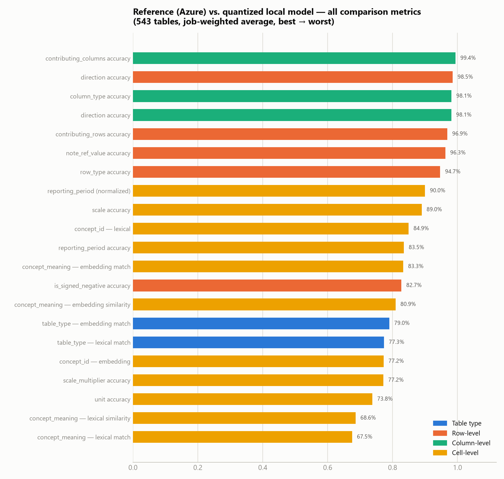

Job-weighted average across 543 compared tables — **ranked best to worst**, colored by what's being compared:

| Rank | Group | Metric | Score |
|---|---|---|---|
| 1 | Column | `contributing_columns` accuracy | 99.4% |
| 2 | Row | `direction` accuracy | 98.5% |
| 3 | Column | `column_type` accuracy | 98.1% |
| 3 | Column | `direction` accuracy | 98.1% |
| 5 | Row | `contributing_rows` accuracy | 96.9% |
| 6 | Row | `note_ref_value` accuracy | 96.3% |
| 7 | Row | `row_type` accuracy | 94.7% |
| 8 | Cell | `reporting_period` (normalized) | 90.0% |
| 9 | Cell | `scale` accuracy | 89.0% |
| 10 | Cell | `concept_id` — lexical | 84.9% |
| 11 | Cell | `reporting_period` accuracy | 83.5% |
| 12 | Cell | `concept_meaning` — embedding match | 83.3% |
| 13 | Row | `is_signed_negative` accuracy | 82.7% |
| 14 | Cell | `concept_meaning` — embedding similarity | 80.9% |
| 15 | Table type | Embedding match | 79.0% |
| 16 | Table type | Lexical match | 77.3% |
| 17 | Cell | `concept_id` — embedding | 77.2% |
| 17 | Cell | `scale_multiplier` accuracy | 77.2% |
| 19 | Cell | `unit` accuracy | 73.8% |
| 20 | Cell | `concept_meaning` — lexical similarity | 68.6% |
| 21 | Cell | `concept_meaning` — lexical match | 67.5% |

**Reading this:** structure survives quantization and distillation almost perfectly — column typing (98.1%), row typing (94.7%), and direction/contributing-row/column linkage (97–99%) are all high. The two soft spots are **`table_type` classification** (77–79%) and **free-text semantic fields** (`concept_meaning`, `unit`, `scale_multiplier` — 67–78%). Both are the hardest, most open-ended fields in the schema: `table_type` is a 2,232-value open vocabulary (§5.1 of the dataset report), and `concept_meaning`/`unit` require the model to produce free-text financial terminology rather than pick from a small closed set — exactly where a 4B model, further compressed to 6-bit, is most likely to drift from its teacher's exact wording even while getting the underlying structure right.

---

## 4. Structural accuracy distribution

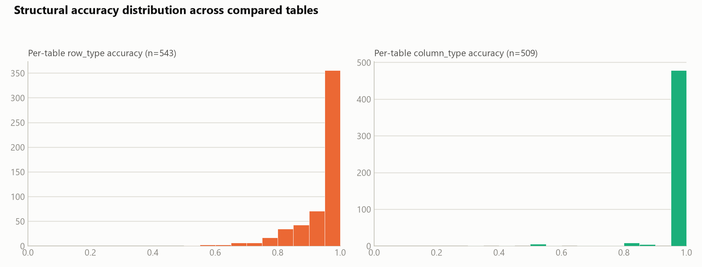

Both `row_type` and `column_type` accuracy are heavily concentrated at 1.0 — most tables are labeled perfectly or nearly perfectly at the structural level; the mass below 0.8 is a comparatively small tail (see §7 for what's in that tail).

---

## 5. Cell-level concept tagging

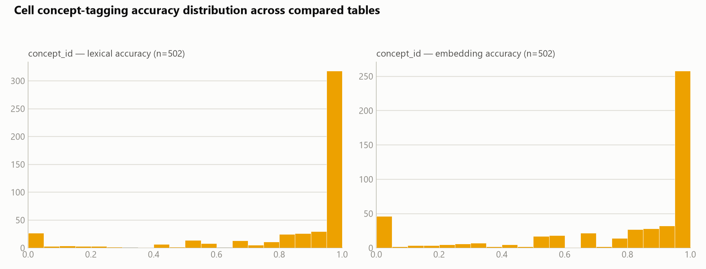

`concept_id` (n=502 tables with at least one concept-bearing cell) shows a similar pattern to structural fields — most tables score at or near 1.0 — but with a heavier left tail than `row_type`/`column_type`, and a visible secondary cluster near 0 on the embedding metric. This is consistent with a subset of tables where the model either omits concept tagging entirely or tags with a semantically unrelated concept, dragging the embedding-similarity score to near-zero for that table while lexical similarity (which credits partial string overlap) stays comparatively higher.

---

## 6. Generalization check — in-sample vs. held-out documents

A natural question for any distillation eval: is the model actually learning the task, or partly just recalling documents it already saw during training? 34 of the 61 evaluated job directories correspond to documents that were part of the 253-job training source corpus (`data_raw_in_out_jsons_200726`); the remaining 24 documents (26 jobs) were never seen during training.

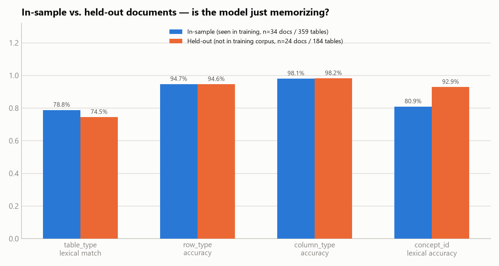

| Metric | In-sample (34 docs / 359 tables) | Held-out (24 docs / 184 tables) | Gap |
|---|---|---|---|
| `table_type` lexical match | 78.8% | 74.5% | −4.3 pp |
| `row_type` accuracy | 94.7% | 94.6% | −0.1 pp |
| `column_type` accuracy | 98.1% | 98.2% | +0.1 pp |
| `concept_id` lexical accuracy | 80.9% | 92.9% | **+12.0 pp** |

**Structural typing (`row_type`, `column_type`) shows no meaningful memorization gap** — the model performs identically on documents it has and hasn't seen, which is the strongest evidence in this report that it learned the general structural task rather than memorizing specific documents. `table_type` shows a modest 4.3-point gap consistent with some memorization advantage on the open-vocabulary classification field. `concept_id` accuracy is actually *higher* on held-out documents — almost certainly a sampling artifact of which table types happen to fall in each bucket (held-out cell-level comparisons come from fewer, different tables) rather than a genuine held-out advantage; it should not be read as the model doing better on unseen data.

---

## 7. Where the model performs well — and where it struggles

### 7.1 Best-scoring documents

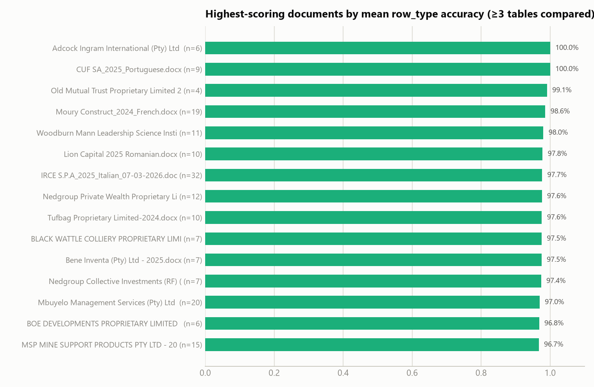

15 documents (with ≥3 tables compared, to rule out lucky small samples) score 96.7–100% mean `row_type` accuracy — a meaningful chunk of the corpus is handled essentially perfectly end-to-end.

### 7.2 Largest tables handled with a perfect clean sweep

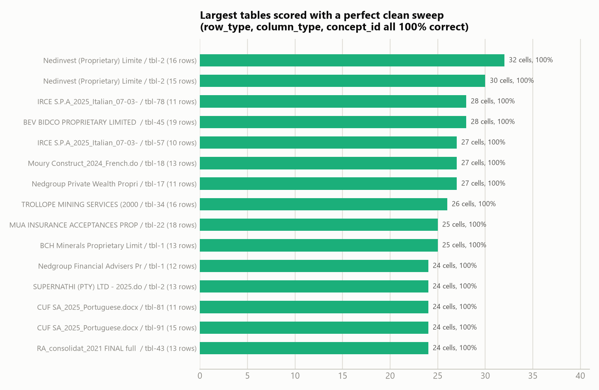

These aren't trivial 1–2 row tables — the top performer (`Nedinvest`, tbl-2) has 16 rows and 32 compared cells, every one of them correct on `row_type`, `column_type`, *and* `concept_id` simultaneously. This is the strongest evidence that the model isn't just pattern-matching small tables; it holds up on genuinely complex ones too.

### 7.3 Does table complexity actually hurt accuracy?

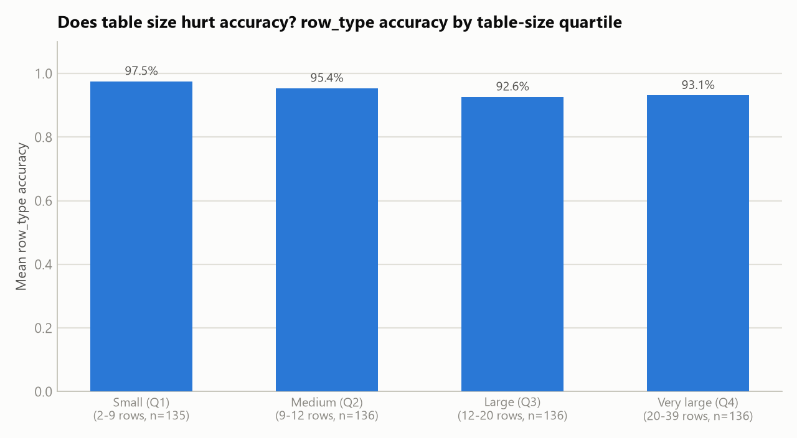

Splitting all 543 tables into size quartiles by row count: accuracy does drift down from **97.5%** on the smallest tables (2–9 rows) to **92.6–93.1%** on the largest (12+ rows) — a real but modest ~4-5 point effect, and it **plateaus** rather than continuing to fall for the very largest tables. Complexity is a headwind, not a cliff.

### 7.4 Lowest-scoring documents

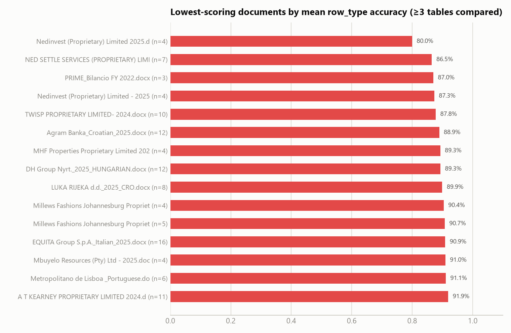

### 7.5 Lowest-scoring individual tables

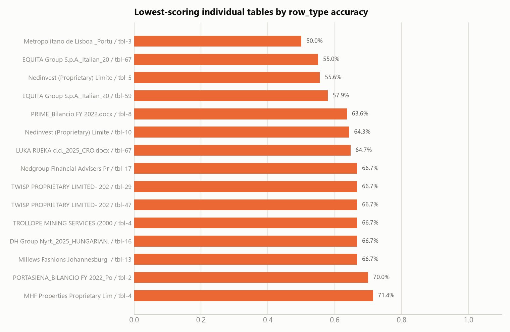

Two patterns show up in the weakest documents: (1) several are very small documents (3–5 financial tables total), where one or two mis-typed rows swing the document-level average heavily — these are noisy signals, not necessarily systematically hard documents; (2) documents with real structural complexity (EQUITA Group's Italian filing, Metropolitano de Lisboa's Portuguese filing) score lower across their *own* larger table set (16 and 6 tables respectively), which is a more reliable signal of genuine difficulty. Language of the source document was checked as a hypothesis for the weak tail and **ruled out** — foreign-language filings score statistically indistinguishably from English filings across the full 543-table set (row_type accuracy 94.3% foreign vs. 94.8% English; `table_type` match is actually higher on foreign-language filings, 81.5% vs. 76.1%).

---

## 8. Inference performance

| | |
|---|---|
| Jobs with successful inference + comparison | 60 |
| Total inference wall-clock time | 17,166 s ≈ 4.77 hours |
| Mean / median time per job | 286 s / 246 s |
| Tables attempted (manifest) | 554 |
| Inference errors | 4 (all `400 Bad Request` from the local llama.cpp completion endpoint — 0.7% error rate) |

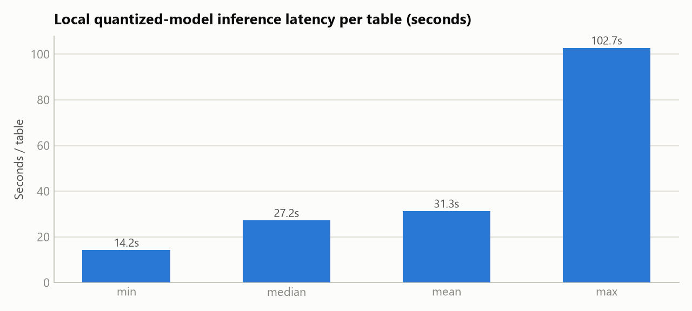

Median latency of 27 seconds per table (mean 31s, tail up to 103s) on the Q6_K-quantized model, served on the single T4 GPU described in §2 — consistent with single-request serving of a model producing very long structured completions (median ~9K characters per response, per the training dataset report). The 4 failures are almost certainly the model's largest tables hitting a context or generation-length limit on the serving endpoint, consistent with the completion-length tail (p99 ≈ 53K characters) documented in the training data EDA.

---

## 9. Cost & capacity analysis for stakeholders

This section translates the measured latency numbers into what they mean in dollars and turnaround time on the deployed **NVIDIA T4 instance ($384/month, billed per second, `172.190.13.101`)**.

### 9.1 What this deployment actually costs to run

| | |
|---|---|
| Deployment rate | $384/month ⇒ **$0.526/hour ⇒ $0.000146/second** (730-hour average month) |
| Marginal cost per table (mean / median latency) | **$0.0046** / **$0.0040** |
| Cost of a typical ~9-table document | **≈ $0.041** |
| Cost of this entire 543-table evaluation run | **≈ $2.51** (17,166 s of measured GPU time) |
| Cost of one full pass over the entire document corpus (6,260 financial tables) | **≈ $28.63**, ≈ 54.4 hours |
| Theoretical single-instance capacity | **≈ 84,000 tables/month** if kept continuously busy end-to-end |

### 9.2 Why utilization is the number that matters, not the sticker price

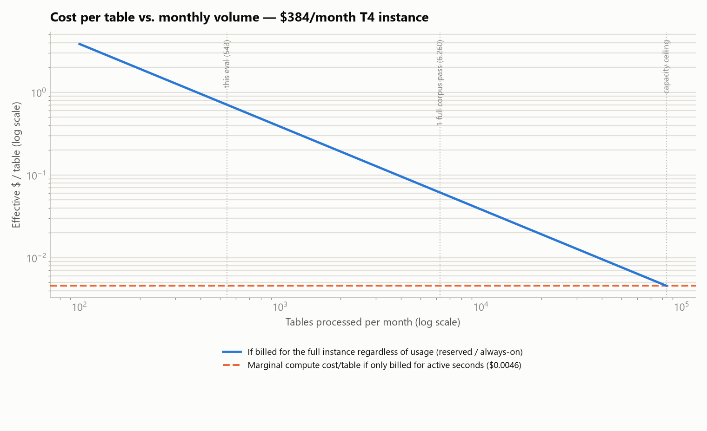

$384/month sounds like a fixed bill, but the per-table economics depend entirely on how much volume actually runs through the instance in a month — because the *marginal* compute cost (~$0.0046/table) is over 100x cheaper than what you'd pay per table if the box sat mostly idle:

- At the volume of **this evaluation** (543 tables), if that were a whole month's workload on a dedicated instance, the effective cost is **~$0.71/table** — the instance is barely used.
- At **one full pass over the entire 6,260-table document corpus** in a month, effective cost drops to **~$0.061/table**.
- Only near the **~84,000 tables/month capacity ceiling** does the effective cost converge to the ~$0.0046/table marginal rate.
- **The practical question for stakeholders is therefore "how many tables per month will actually be processed?"**, not "is $384/month expensive" — the same instance is either a bargain or a poor deal by a factor of 100+ depending on that answer. If actual monthly volume is well below capacity, either (a) confirm the per-second billing genuinely scales the bill down (the instance is stopped/scaled-to-zero between batches), or (b) plan to consolidate more document-processing workload onto this instance to justify the reserved cost.

### 9.3 Turnaround time — what stakeholders can tell users to expect

Using the measured mean latency (31.3 s/table) against the full source-corpus's document sizes:

| Document size | Tables | Estimated turnaround (single instance, serial) |
|---|---|---|
| Median document | 11.5 | **~6 minutes** |
| Mean document | 25.0 | **~13 minutes** |
| Largest document seen (a 20-F filing) | 222 | **~1.9 hours** |

### 9.4 Two concrete levers to improve the economics

1. **Concurrency is untapped.** The measured latency looks like strictly serial, one-table-at-a-time processing — nothing in the manifests suggests multiple tables are being sent to the GPU at once. llama.cpp's server supports parallel request slots on a single loaded model; if the T4's 16 GB of memory has headroom beyond the 3.23 GiB Q6_K weights (it should), running several tables concurrently could multiply effective throughput on the *same* $384/month instance — directly improving every cost-per-table figure in §9.1 without new hardware spend.
2. **Reliability at scale.** The 0.7% inference error rate (§8) is small per-table but compounds with volume: at the ~84,000 tables/month capacity ceiling, that rate implies **~590 failed tables/month** needing a retry path or manual fallback. Worth budgeting for that operationally before scaling volume up, not after.

---

## 10. Notes and caveats

1. **This measures agreement with the training teacher, not ground truth.** The "reference" in every comparison is the original Azure-model-generated label the dataset was built from — the same labels the model was fine-tuned to reproduce. High agreement confirms successful distillation + quantization fidelity; it does not independently confirm the *reference* labels themselves were correct. A gap here could mean the local model is wrong, or that it's right and the original Azure label was the noisy one — this report can't distinguish the two.
2. **56% of evaluated documents were seen during training.** §6 shows this doesn't meaningfully inflate structural metrics, but the `table_type` figure (77–79% overall) should be read with the −4.3pp held-out gap in mind if the number is used to represent held-out/production performance specifically.
3. **1 job directory (`Cube Shelf Co Proprietary Limited - 2025.docx`) was excluded** — its `compare/` folder had only 2 of 7 expected per-table comparisons at the time this report was generated (comparison pipeline appears to still be running); it contributes 0 rows to every aggregate above.
4. **Metrics are job-weighted averages, not simple means-of-means.** A direct table-level ("micro") recomputation of the 8 fields available at that granularity matches the job-weighted figures to within 0.1 point (e.g. `row_type_accuracy` 94.67% weighted vs. 94.67% micro), confirming the weighting doesn't distort the headline numbers.
5. **Small-sample documents dominate the "worst" list.** Most of the lowest-scoring documents in §7.4 have only 3–5 compared tables; a single wrong row_type call on a 6-row table moves that document's average by ~15+ points. Treat the worst-document ranking as a starting point for spot-checking, not a reliable severity ranking on its own.
6. **The §9 cost figures rest on stated assumptions, not billing data.** "$384/month" was converted to a per-second rate using a 730-hour average month — the cloud-industry convention, but not verified against an actual invoice. The "always-on / reserved" curve in §9.2 assumes the instance is provisioned and billed for the full month regardless of workload; if the deployment is genuinely elastic (scales down or stops between batches), real-world cost will track much closer to the $0.0046/table marginal-cost line instead. No cost figure for the Azure reference pipeline was available, so this report cannot state whether the T4 deployment is cheaper or more expensive than the system it's replacing — only what it costs in isolation.
7. Full raw statistics are in `report_assets/eval_stats.json`; regenerate with `report_assets/analyze_eval.py` and `report_assets/eval_chart_gen.py`.
