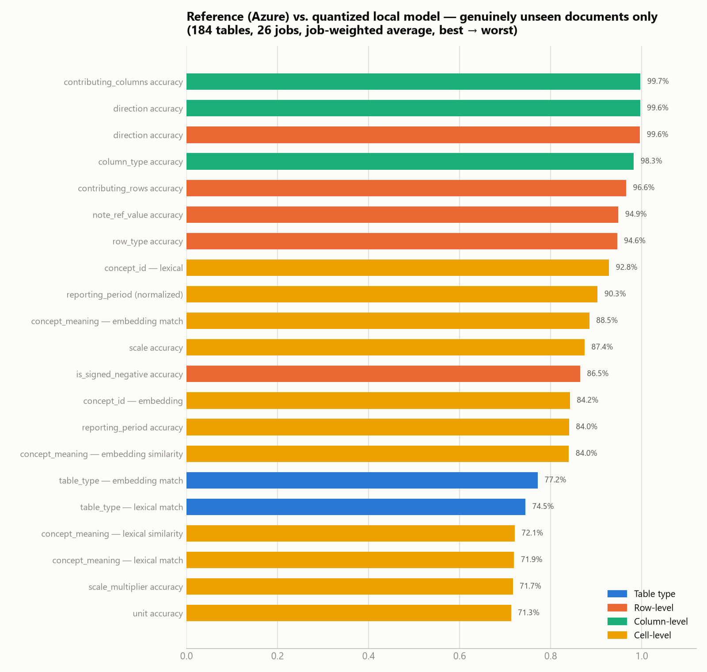
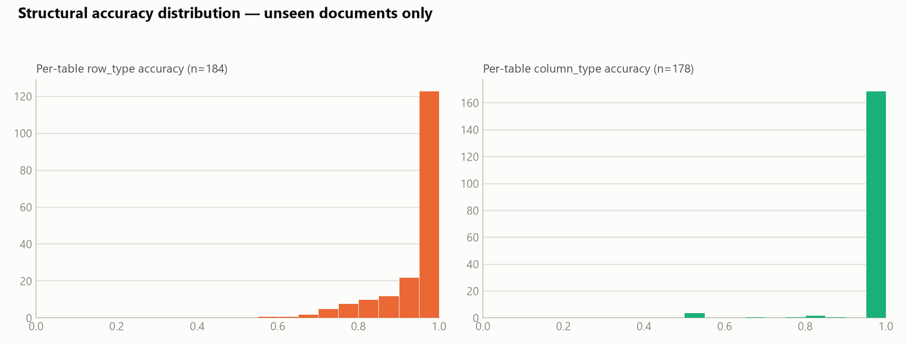
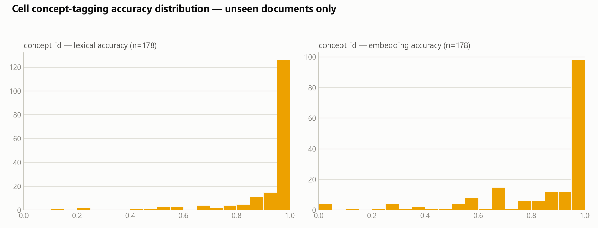
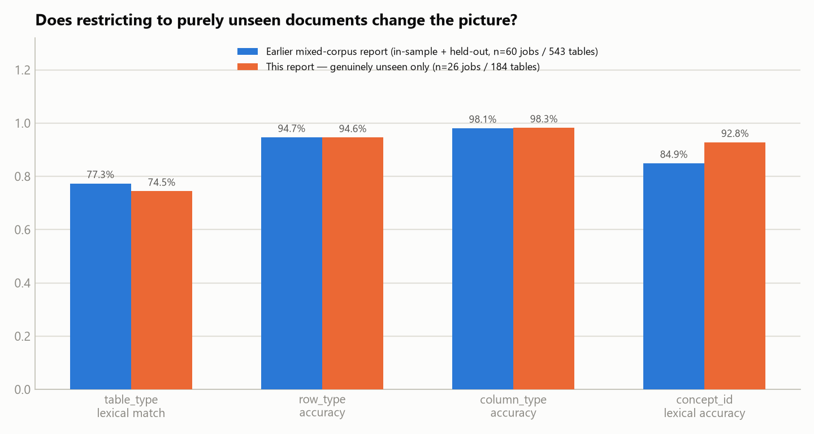
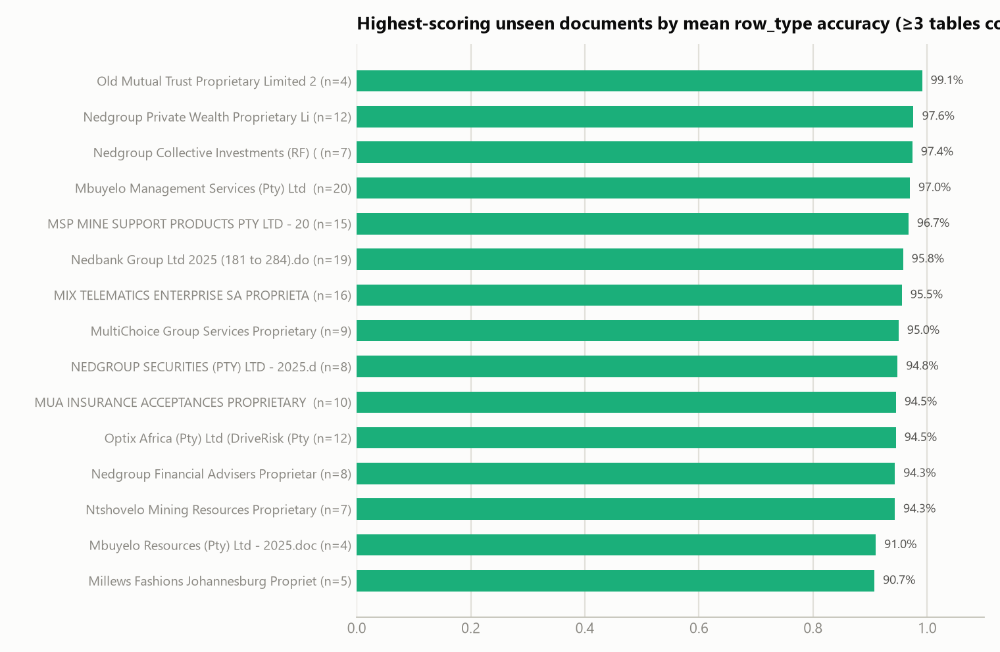
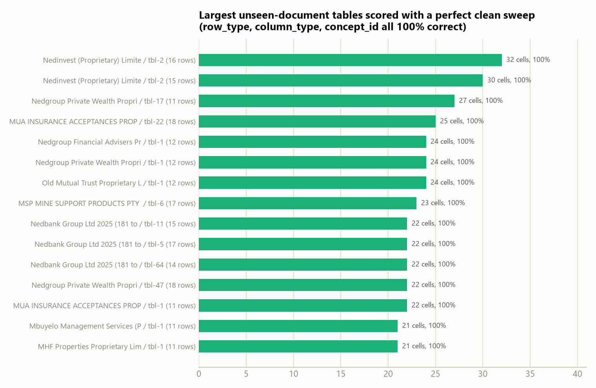
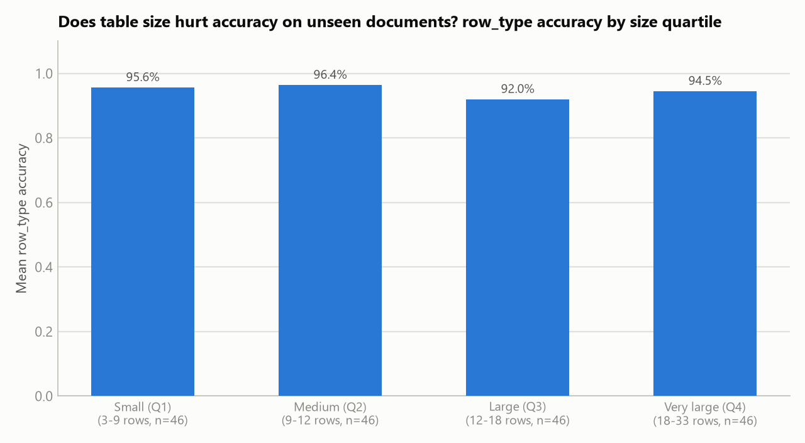
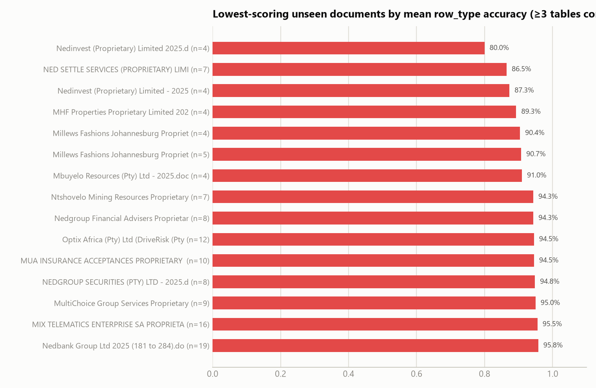
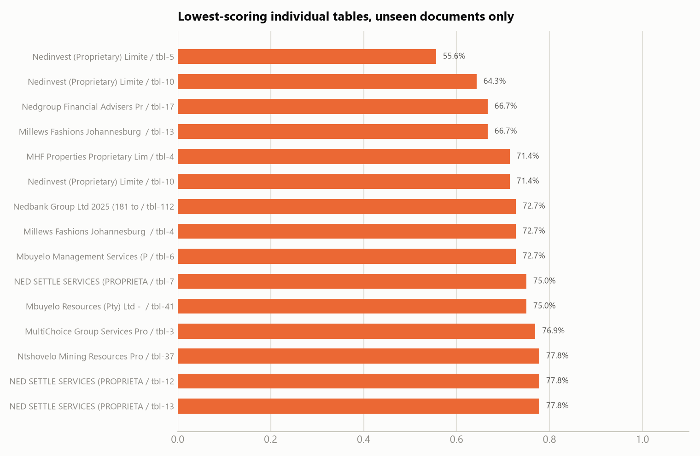
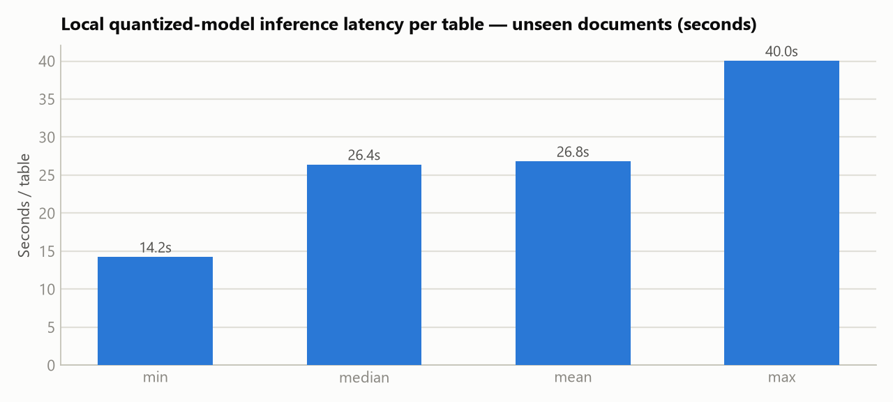

# Evaluation & Metrics Report — Genuinely Unseen Documents Only

**Model under test:** `merged_Qwen3.5-4B_v16v2_clean_dataset_210726_fp16-Q6_K.gguf` (Q6_K quantized, 3.23 GiB — the same model evaluated in the 2026-07-24 report)
**Deployment:** NVIDIA T4 GPU instance, `http://172.190.13.101/` — $384/month, billed per second
**Comparison metrics source:** `compare/` subfolders under `D:\Dev\custom_llm_outputs\completed_unseen` — the 26 job directories confirmed to have **zero overlap** with the 253-job training source corpus
**Report generated:** 2026-07-27

**What this report is:** the 2026-07-24 Evaluation & Metrics Report mixed 34 in-sample documents with 26 held-out ones and only briefly summarized the held-out slice (§6 of that report). This report gives that held-out slice — the same 26 job directories, re-compared fresh on 2026-07-27 — the full breakdown the whole mixed corpus received: every metric, distribution histograms, best/worst documents and tables, and a table-size-vs-accuracy check. **This is not new data collected since the last report; it is the existing held-out subset analyzed in full**, plus a direct comparison back to the earlier mixed-corpus numbers (§6).

---

## 1. Executive summary

Metric rows are ordered **best → worst** throughout this report (see §3 for the full ranked list of all 20 metrics).

| Metric | Value |
|---|---|
| **`column_type` accuracy** | **98.3%** |
| **`row_type` accuracy** | **94.6%** |
| Cell `concept_id` accuracy (lexical / embedding) | 92.8% / 84.2% |
| Cell `concept_meaning` similarity (lexical / embedding) | 72.1% / 84.0% |
| **`table_type` match rate** (embedding / lexical) | **77.2% / 74.5%** |
| Job directories evaluated | 26 (26 with a completed comparison) |
| Unique source documents | 24 |
| Tables compared (reference label vs. model output) | 184 |
| Inference errors during generation | 2 of 186 attempted tables (1.1%) |
| Median inference latency | 26.4 s/table (mean 26.8 s/table) |
| vs. the 2026-07-24 mixed-corpus report | Structural metrics: **±0.1–0.2 pp** · `table_type` match: **−2.9 pp** · `concept_id` lexical: **+7.9 pp** (see §6 for why that last gap is a sampling artifact, not a real advantage) |

**What this measures:** every `compare_tbl-*.json` scores the quantized local model's output (the "candidate") against the same table's original Azure-generated label (the "reference") — i.e. it measures **fidelity to the teacher labels the model was fine-tuned to imitate**, not correctness against independently audited ground truth. See §9 for why that distinction matters, and see the 2026-07-24 report's §9 for the full deployment cost/capacity analysis (unchanged by which document subset is evaluated here).

---

## 2. Evaluation setup

| | |
|---|---|
| Model file | `merged_Qwen3.5-4B_v16v2_clean_dataset_210726_fp16-Q6_K.gguf` |
| Quantization | Q6_K (llama.cpp GGUF), 3.23 GiB vs. 7.85 GiB fp16 source |
| Serving | Local llama.cpp server (`http://127.0.0.1:8080/completion`) |
| Production deployment | NVIDIA T4 GPU instance at `http://172.190.13.101/` |
| Base checkpoint | Merged LoRA adapter (`teamspace_uploads_Qwen3.5-4B_v16v2_clean_dataset_220726_3epochs`) + Qwen/Qwen3.5-4B, merged via `merge_model.py` |
| Evaluation harness | Same pipeline as the 2026-07-24 report: run the quantized model over every financial table already labeled by Azure → write `classify_tbl-N_response_customllm.json` → diff against `classify_tbl-N_response.json` field-by-field → write `compare/compare_tbl-N.json` + a per-job `compare/compare_summary.json` |
| Comparison fields | `table_type` (lexical + embedding similarity), row `row_type` / `is_signed_negative` / `direction` / `note_ref_value` / `contributing_rows`, column `column_type` / `direction` / `contributing_columns`, cell `unit` / `scale` / `scale_multiplier` / `reporting_period` / `concept_id` / `concept_meaning` |
| Job dirs evaluated | 26, verified to have **zero** job-ID overlap with the 253-job training source corpus (`data_raw_in_out_jsons_200726`) — this set is genuinely unseen, not a sample that happens to score well |

---

## 3. Overall accuracy — all 20 comparison metrics

Job-weighted average across 184 compared tables — **ranked best to worst**, colored by what's being compared:

| Rank | Group | Metric | Score |
|---|---|---|---|
| 1 | Column | `contributing_columns` accuracy | 99.7% |
| 2 | Row | `direction` accuracy | 99.6% |
| 2 | Column | `direction` accuracy | 99.6% |
| 4 | Column | `column_type` accuracy | 98.3% |
| 5 | Row | `contributing_rows` accuracy | 96.6% |
| 6 | Row | `note_ref_value` accuracy | 94.9% |
| 7 | Row | `row_type` accuracy | 94.6% |
| 8 | Cell | `concept_id` — lexical | 92.8% |
| 9 | Cell | `reporting_period` (normalized) | 90.3% |
| 10 | Cell | `concept_meaning` — embedding match | 88.5% |
| 11 | Cell | `scale` accuracy | 87.4% |
| 12 | Row | `is_signed_negative` accuracy | 86.5% |
| 13 | Cell | `concept_id` — embedding | 84.2% |
| 14 | Cell | `reporting_period` accuracy | 84.0% |
| 14 | Cell | `concept_meaning` — embedding similarity | 84.0% |
| 16 | Table type | Embedding match | 77.2% |
| 17 | Table type | Lexical match | 74.5% |
| 18 | Cell | `concept_meaning` — lexical similarity | 72.1% |
| 19 | Cell | `concept_meaning` — lexical match | 71.9% |
| 20 | Cell | `scale_multiplier` accuracy | 71.7% |
| 21 | Cell | `unit` accuracy | 71.3% |

**Reading this:** the same pattern the full mixed corpus showed holds up on documents the model never trained on — structural fields (`contributing_columns`, `direction`, `column_type`, `row_type`) all sit at 94.6–99.7%, while the two soft spots remain **`table_type` classification** (74–77%) and **free-text semantic fields** (`concept_meaning`, `unit`, `scale_multiplier` — 71–72%). Nothing here suggests the model's strengths on the mixed corpus were inflated by memorized documents.

---

## 4. Structural accuracy distribution

Both `row_type` and `column_type` accuracy are heavily concentrated at 1.0, same as the full corpus — most unseen tables are labeled perfectly or nearly perfectly at the structural level.

---

## 5. Cell-level concept tagging

`concept_id` (n=178 tables with at least one concept-bearing cell) shows most tables scoring at or near 1.0, with a left tail on the embedding metric similar in shape to the full-corpus distribution.

---

## 6. Does restricting to purely unseen documents change the picture?

| Metric | Earlier mixed report (60 jobs / 543 tables) | This report — unseen only (26 jobs / 184 tables) | Gap |
|---|---|---|---|
| `table_type` lexical match | 77.3% | 74.5% | −2.9 pp |
| `row_type` accuracy | 94.7% | 94.6% | −0.1 pp |
| `column_type` accuracy | 98.1% | 98.3% | +0.1 pp |
| `concept_id` lexical accuracy | 84.9% | 92.8% | **+7.9 pp** |

**Structural typing shows essentially no gap** — row_type and column_type land within ±0.1 point of the blended in-sample+held-out corpus, reinforcing that the model learned the general structural task rather than memorizing specific documents. `table_type` is modestly lower on unseen-only data (−2.9pp), consistent with some memorization advantage on that open-vocabulary field. `concept_id` lexical accuracy is *higher* here — as flagged in the 2026-07-24 report's held-out check, this is almost certainly a sampling artifact (this 184-table subset happens to contain a different mix of concept-bearing cells than the full 543-table corpus), not evidence the model does better on unseen data; it should not be read as a real advantage.

---

## 7. Where the model performs well — and where it struggles

### 7.1 Best-scoring unseen documents

Documents with ≥3 tables compared, to rule out lucky small samples: the top scorer (Old Mutual Trust Proprietary Limited) reaches 99.1% mean `row_type` accuracy, and several others clear 95%.

### 7.2 Largest unseen tables handled with a perfect clean sweep

The top performer (`Nedinvest`, tbl-2, 16 rows / 32 compared cells) scores 100% on `row_type`, `column_type`, *and* `concept_id` simultaneously — the same evidence as the full-corpus report that the model isn't just pattern-matching small tables, even restricted to documents it never trained on.

### 7.3 Does table complexity actually hurt accuracy on unseen documents?

Splitting the 184 unseen tables into size quartiles by row count: accuracy moves from 95.6% (Q1, smallest) → 96.4% (Q2) → 92.0% (Q3) → 94.5% (Q4, largest) — a mild, non-monotonic wobble of a few points rather than the steadier decline seen on the full mixed corpus. With only 46 tables per quartile here, this is too small a sample to call a real complexity effect one way or the other; it does **not** show the largest unseen tables being the worst-handled ones.

### 7.4 Lowest-scoring unseen documents

### 7.5 Lowest-scoring individual unseen tables

The same pattern as the full-corpus report shows up here: most of the weakest documents (Nedinvest, Millews Fashions, MHF Properties) have only 4–5 compared tables, so one or two mis-typed rows swing the document average by 15–40 points — these are noisy small-sample signals, not necessarily systematically hard documents. With only 24 unique documents in this set, the "worst" and "best" document lists in §7.1/7.4 overlap almost entirely (the full ranking, not two disjoint groups) — read both as one continuum, not two separate populations.

---

## 8. Inference performance

| | |
|---|---|
| Jobs with successful inference + comparison | 26 |
| Total inference wall-clock time | 4,886 s ≈ 1.36 hours |
| Mean / median time per job | 188 s / 162 s |
| Tables attempted (manifest) | 186 |
| Inference errors | 2 (1.1% error rate) |

Median latency of 26.4 seconds per table (mean 26.8s), in line with the 2026-07-24 report's full-corpus figures (median 27.2s, mean 31.3s) — this subset's latency is not meaningfully different from the blended corpus, so the cost-per-table and capacity figures in that report's §9 apply unchanged here; they are not repeated in this report.

---

## 9. Notes and caveats

1. **This is the same 26-job held-out subset from the 2026-07-24 report, not newly collected data.** It was re-compared on 2026-07-27; the resulting numbers match the earlier held-out bucket to within rounding (e.g. `row_type_accuracy` 94.59% then vs. 94.59% now), confirming the comparison pipeline is stable and this report's numbers are consistent with the earlier finding.
2. **This measures agreement with the training teacher, not ground truth.** The "reference" in every comparison is the original Azure-model-generated label — the same labels the model was fine-tuned to reproduce. High agreement confirms distillation + quantization fidelity; it does not independently confirm the Azure labels themselves were correct.
3. **Metrics are job-weighted averages, not simple means-of-means.** A direct table-level ("micro") recomputation of the 6 fields available at that granularity matches the job-weighted figures to within 0.2 point, confirming the weighting doesn't distort the headline numbers.
4. **Small-sample documents dominate the best/worst lists.** With only 24 unique documents total, most have 4–10 compared tables; treat document-level rankings as a starting point for spot-checking, not a precise severity ranking.
5. **`concept_id`'s apparent held-out advantage (§6) is a sampling artifact, not a generalization finding** — carried forward from the same caveat in the 2026-07-24 report.
6. Full raw statistics are in `report_assets/eval_stats_unseen.json`; regenerate with `report_assets/analyze_eval_unseen.py` and `report_assets/eval_chart_gen_unseen.py`. For the full deployment cost/capacity analysis, see §9 of `Evaluation_and_Metrics_Report.docx` (2026-07-24) — that analysis is a property of the T4 deployment, not of which document subset is evaluated, and is unchanged here.
